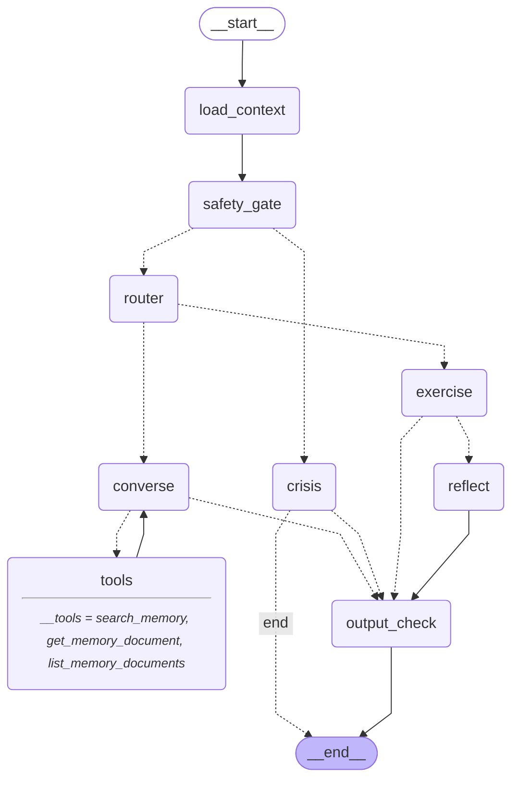

# Per-turn graph

Generated from the compiled graph: `build_graph(model).get_graph().draw_mermaid()`.
Solid arrows are fixed edges; dotted arrows are conditional edges.

```mermaid
---
config:
  flowchart:
    curve: linear
---
graph TD;
	__start__([<p>__start__</p>]):::first
	load_context(load_context)
	safety_gate(safety_gate)
	crisis(crisis)
	router(router)
	converse(converse)
	exercise(exercise)
	reflect(reflect)
	tools(tools<hr/><small><em>__tools = search_memory, get_memory_document, list_memory_documents</em></small>)
	output_check(output_check)
	__end__([<p>__end__</p>]):::last
	__start__ --> load_context;
	converse -.-> output_check;
	converse -.-> tools;
	crisis -. &nbsp;end&nbsp; .-> __end__;
	crisis -.-> output_check;
	exercise -.-> output_check;
	exercise -.-> reflect;
	load_context --> safety_gate;
	reflect --> output_check;
	router -.-> converse;
	router -.-> exercise;
	safety_gate -.-> crisis;
	safety_gate -.-> router;
	tools --> converse;
	output_check --> __end__;
	classDef default fill:#f2f0ff,line-height:1.2
	classDef first fill-opacity:0
	classDef last fill:#bfb6fc
```
